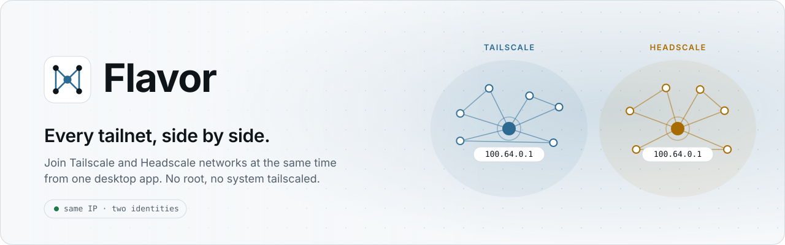
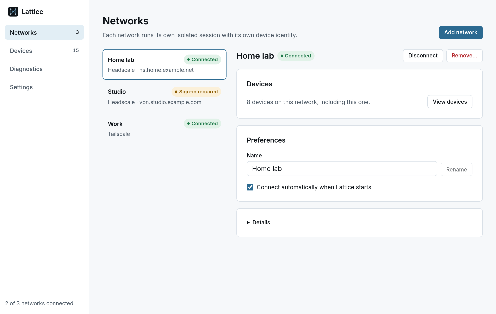
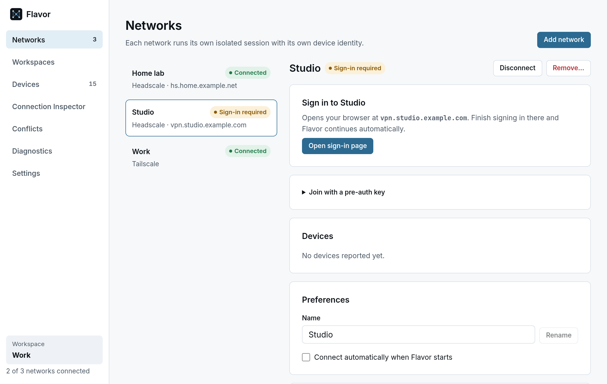
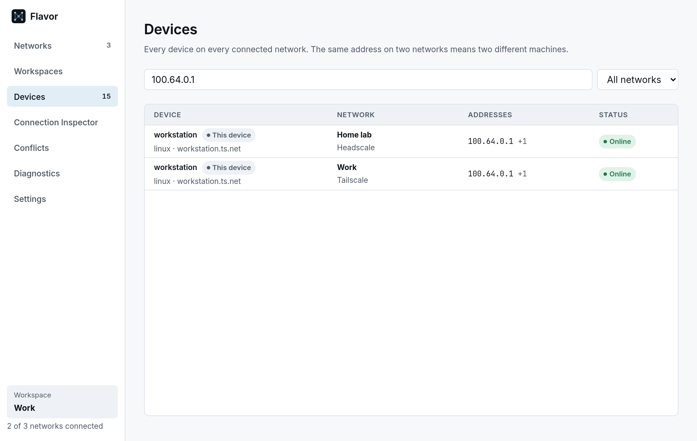
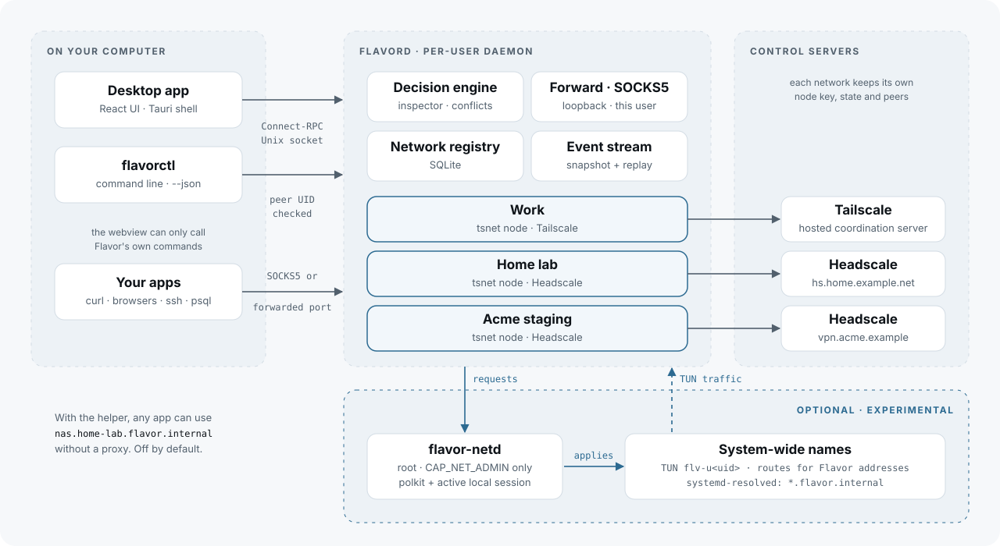

<div align="center">

<picture>
  <source media="(prefers-color-scheme: dark)" srcset="assets/readme/banner-dark.svg">
  
</picture>

<br>
<br>

[](https://github.com/tame-gg/lattice/actions/workflows/ci.yml) [](LICENSE) [](#requirements) [](https://github.com/tame-gg/lattice/stargazers) [](https://github.com/tame-gg/lattice/commits) [](https://github.com/tame-gg/lattice)

[](go.mod) [](Cargo.toml) [](desktop/src-tauri) [](desktop) [](https://pkg.go.dev/tailscale.com/tsnet)

**[Quick start](#quick-start)** · **[How it works](#how-it-works)** · **[CLI](#cli)** · **[Security](#security-model)** · **[Development](#development)**

</div>

---

The system Tailscale client joins one tailnet at a time. Switching between a work account, a personal tailnet and a self-hosted Headscale means logging out, logging in and dropping every connection in between.

**Lattice keeps them all connected at once.** A small per-user daemon runs one isolated, embedded Tailscale node for each network you add. Each has its own device identity, state directory and peer list. A Tauri desktop app and a CLI drive it over a local socket. It needs no root and no system `tailscaled`.

<picture>
  <source media="(prefers-color-scheme: dark)" srcset="assets/readme/networks-dark.png">
  
</picture>

<table>
  <tr>
    <td width="50%">
      <picture>
        <source media="(prefers-color-scheme: dark)" srcset="assets/readme/signin-dark.png">
        
      </picture>
      <p align="center"><sub><b>Explicit sign-in.</b> Shows the destination host and opens only after you click.</sub></p>
    </td>
    <td width="50%">
      <picture>
        <source media="(prefers-color-scheme: dark)" srcset="assets/readme/devices-dark.png">
        
      </picture>
      <p align="center"><sub><b>Same IP, two machines.</b> Devices are keyed by network and node, never by address.</sub></p>
    </td>
  </tr>
</table>

## Features

<table>
  <tr>
    <td width="50%" valign="top"><b>Many tailnets at once</b><br>Tailscale and any number of Headscale servers side by side in one daemon. Each network runs its own embedded <a href="https://pkg.go.dev/tailscale.com/tsnet"><code>tsnet</code></a> node.</td>
    <td width="50%" valign="top"><b>Overlapping addresses are fine</b><br>Both networks handing out <code>100.64.0.1</code> is normal. Every device is identified by <code>{network, node}</code> all the way from the daemon to the UI.</td>
  </tr>
  <tr>
    <td width="50%" valign="top"><b>Unprivileged</b><br>Runs as your user. No root, no TUN device, no system <code>tailscale</code> or <code>tailscaled</code>.</td>
    <td width="50%" valign="top"><b>Sign in your way</b><br>Browser sign-in (including OIDC on a different host) or a one-time pre-auth key that is used once and never stored.</td>
  </tr>
  <tr>
    <td width="50%" valign="top"><b>Survives restarts</b><br>Node identities persist per network, so reconnecting after a reboot needs no keys. <i>Connect automatically when Lattice starts</i> is a per-network choice.</td>
    <td width="50%" valign="top"><b>Remove vs delete</b><br>Removing a network keeps its identity on disk for later. Deleting the identity is a separate, explicit step. Lattice never deletes machines on the control server.</td>
  </tr>
  <tr>
    <td width="50%" valign="top"><b>Connection Inspector</b><br>Type an address or name and see every network it exists on, which device or subnet route matched, how it matched, and whether the answer is unique. Longest-prefix routes and network-qualified names like <code>postgres.home.lattice.internal</code> are explained the same way. The same engine powers <code>latticectl explain</code>.</td>
    <td width="50%" valign="top"><b>Conflict Center</b><br>Every address, DNS name, device name and subnet route that exists more than once, split into expected overlaps (network-specific names or a more specific route decide) and real ambiguities.</td>
  </tr>
  <tr>
    <td width="50%" valign="top"><b>Device Explorer</b><br>Search all networks at once by name, address, network, OS or tag, with qualifiers like <code>is:online</code> and <code>tag:db</code>. Each device opens a details panel with copy, inspect and SSH actions.</td>
    <td width="50%" valign="top"><b>Live and resilient UI</b><br>A snapshot plus an ordered event stream. The UI resyncs on gaps or daemon restarts and keeps showing last-known state while the daemon is away.</td>
  </tr>
  <tr>
    <td width="50%" valign="top"><b>Workspaces</b><br>Name a set of networks after what you are doing, like Work or On Call, and connect them in one step. Optionally disconnect everything else. Identities are never touched.</td>
    <td width="50%" valign="top"><b>Destination preferences</b><br>When an address or name exists on several networks, tell Lattice which one you mean. The inspector, conflict view and CLI all explain the choice. System routing is not changed.</td>
  </tr>
  <tr>
    <td width="50%" valign="top"><b>Scriptable</b><br><code>latticectl</code> speaks the same API as the desktop app, with <code>--json</code> output for automation.</td>
    <td width="50%" valign="top"><b>Private by default</b><br>No telemetry. Device inventories, sign-in links and keys stay on your machine, and Tailscale log upload is disabled for every session.</td>
  </tr>
</table>

## How it works

<picture>
  <source media="(prefers-color-scheme: dark)" srcset="assets/readme/architecture-dark.svg">
  
</picture>

- **`latticed`**: the per-user Go daemon. It owns the SQLite network registry, the system keyring, an in-memory event bus with bounded replay, and one `NetworkSession` per network.
- **IPC**: [Connect-RPC](https://connectrpc.com) over HTTP/2 cleartext on `$XDG_RUNTIME_DIR/lattice/latticed.sock`, mode `0600`. Every connection's UID is checked with `SO_PEERCRED`. The contract lives in [`proto/lattice/v1`](proto/lattice/v1).
- **Desktop**: [Tauri 2](https://tauri.app) with a thin Rust client ([`crates/lattice-ipc`](crates/lattice-ipc)) built on [connect-rust](https://github.com/connectrpc/connect-rust). The React webview never touches the socket. It only calls a fixed list of app commands.
- **Sync**: the UI loads a snapshot stamped with a sequence number, then streams events after that sequence. Missed events, a slow consumer or a restarted daemon all trigger a fresh snapshot instead of silent drift.

## Quick start

### Requirements

- Linux with a user session (`$XDG_RUNTIME_DIR`)
- Go 1.27+, Rust stable, Node 24+
- `libwebkit2gtk-4.1` and `libayatana-appindicator3` for the desktop app

### Install for your user

```bash
./scripts/go.sh build -o ~/.local/bin/latticed   ./cmd/latticed
./scripts/go.sh build -o ~/.local/bin/latticectl ./cmd/latticectl

install -Dm644 packaging/systemd/user/latticed.service ~/.config/systemd/user/latticed.service
systemctl --user daemon-reload
systemctl --user enable --now latticed

(cd desktop && npm ci && npm run tauri build)
./target/release/lattice-desktop
```

> [!NOTE]
> Always build Go through `./scripts/go.sh`. It applies the toolchain settings in [`go.env`](go.env) that the pinned Tailscale version needs.

Closing the window hides Lattice in the tray by default. Quitting the desktop app never stops `latticed` or disconnects your networks.

### Uninstall

```bash
systemctl --user disable --now latticed
rm ~/.config/systemd/user/latticed.service ~/.local/bin/latticed ~/.local/bin/latticectl
rm -rf ~/.local/share/lattice ~/.config/lattice
```

> [!WARNING]
> Removing `~/.local/share/lattice` deletes every local device identity. The machines stay registered on their control servers until an administrator removes them.

## CLI

```console
$ latticectl add --name "Home lab" --headscale https://headscale.example.com --auto-connect
01JA7Q3M0000000000000HOME0

$ printf '%s\n' "$PREAUTH_KEY" | latticectl enroll 01JA7Q3M0000000000000HOME0

$ latticectl list
ID                          NAME      PROVIDER   STATE           AUTO
01JA7Q3M0000000000000HOME0  Home lab  headscale  connected       true
01JA7Q3M0000000000000WORK0  Work      tailscale  authenticating  false
sign in to Work: https://login.tailscale.com/a/…

$ latticectl explain 100.64.0.1
destination  100.64.0.1 (address)
decision     ambiguous: exists on 2 network(s); use a full DNS name to pick one
reason       multiple matches

NETWORK    DEVICE    MATCH           STATUS  ADDRESSES
Home       desktop   device address  tied    100.64.0.1
LunarLabs  prod-api  device address  tied    100.64.0.1

$ latticectl preference set 100.64.0.1 --network LunarLabs
$ latticectl workspace create --name "On Call" <network-id> <network-id>
$ latticectl workspace activate --disconnect-others "On Call"
$ latticectl conflicts
$ latticectl --json explain prod-api
$ latticectl devices
$ latticectl remove [--delete-identity] <network-id>
$ latticectl diag
```

Pre-auth keys are read from stdin, so they never appear in the process list or in command-line arguments.

## Security model

- **Same-user boundary.** The socket is `0600` inside your private runtime directory, and the daemon rejects any peer whose UID differs from its own. It does not try to defend against malware already running as you.
- **Keys are transient.** A pre-auth key goes from the request to the embedded node once, then is dropped. It is never written to SQLite, config, the keyring, logs, events or diagnostics. Automated tests plant a canary key and check that it never shows up in logs, RPC responses, events, diagnostics or any file the daemon writes.
- **No ambient credentials.** The daemon clears `TS_AUTHKEY`/`TS_AUTH_KEY` at startup and refuses to start a node if they are still set. Tailscale log upload is disabled for the whole process.
- **Untrusted webview.** The Tauri capability grants only Lattice's own commands and event listening: no shell, filesystem, HTTP or opener access. CSP is `self` only. Sign-in links are re-read from the daemon by Rust, limited to `http`/`https` without credentials, and opened in the external browser only after you click.
- **Logical isolation.** Sessions run in one process with separate state directories and node keys. They are not process-sandboxed from each other.

## Not in this release

Lattice deliberately ships no placeholder screens. These are planned and not built:

- System routing, a TUN device and a minimal privileged helper
- Collision-safe DNS and synthetic addressing for overlapping subnets
- Exit nodes, subnet route controls and a SOCKS/HTTP proxy
- Windows and macOS
- Remote node removal on the control server

## Development

```bash
./scripts/go.sh run ./cmd/latticed              # daemon on the default socket
cd desktop && npm install && npm run tauri dev  # desktop app with hot reload
```

No tailnet handy? `./scripts/go.sh run ./test/fakedaemon` serves the same API with simulated sessions. Control URLs containing `login` or `approval` simulate those states.

```bash
./scripts/go.sh test ./...          # Go: services, sessions, IPC end to end
cargo test --workspace              # Rust: client against a real daemon, Tauri settings
cd desktop && npm test              # Frontend: sync controller, device keys, link rules
./scripts/generate-proto.sh         # regenerate Go, TypeScript and Rust bindings
```

Real control planes: `test/acceptance/headscale-concurrent.sh` runs two local Headscale servers in Docker and checks concurrent sessions, restart persistence, remove vs delete, and that no key reaches disk or logs.

```bash
docker compose -f test/integration/headscale/compose.yml --profile dual up -d
./test/acceptance/headscale-concurrent.sh
```

<details>
<summary><b>Repository layout</b></summary>

```text
cmd/latticed            daemon entry point
cmd/latticectl          command-line client
internal/app            process lifecycle: lock, startup order, phased shutdown
internal/service        use-cases: networks, devices, diagnostics, snapshot
internal/session        one tsnet node per network; lifecycle and peer projection
internal/ipc            Unix socket transport, peer credentials, Connect handlers
internal/store          SQLite registry and retained identities
internal/secret         Secret Service keyring and in-memory store
internal/events         event bus with bounded replay
proto/lattice/v1        IPC contract
gen/                    generated Go and TypeScript bindings
crates/lattice-proto    generated Rust bindings
crates/lattice-ipc      Rust daemon client
desktop/                React UI and Tauri shell
packaging/              systemd user unit
test/                   fake daemon, Headscale harness, acceptance script
```

</details>

## License

[MIT](LICENSE) © 2026 Luna
