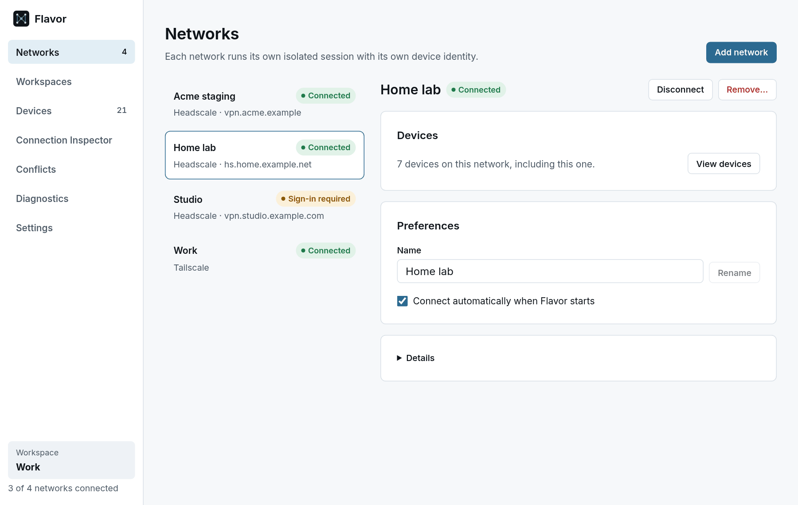
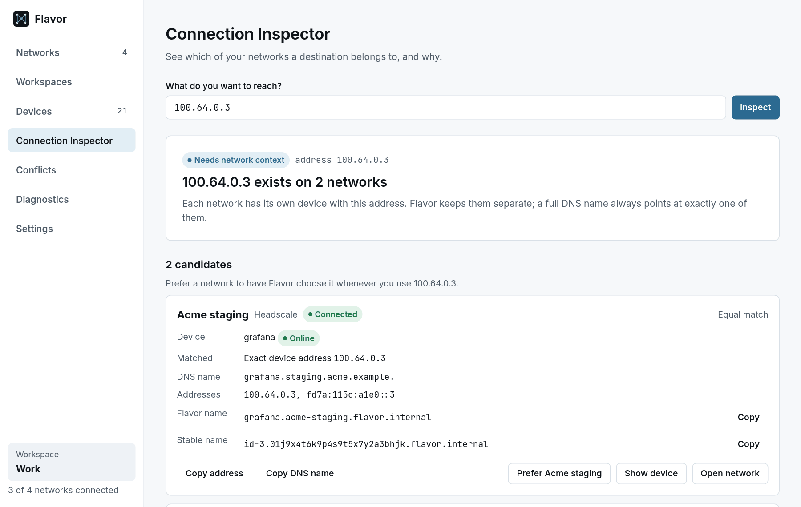
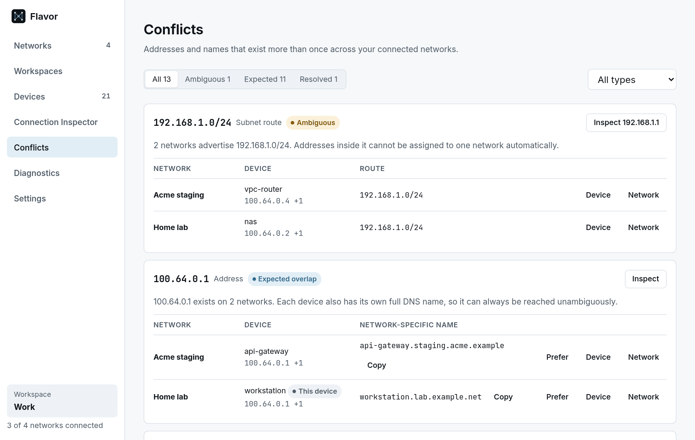
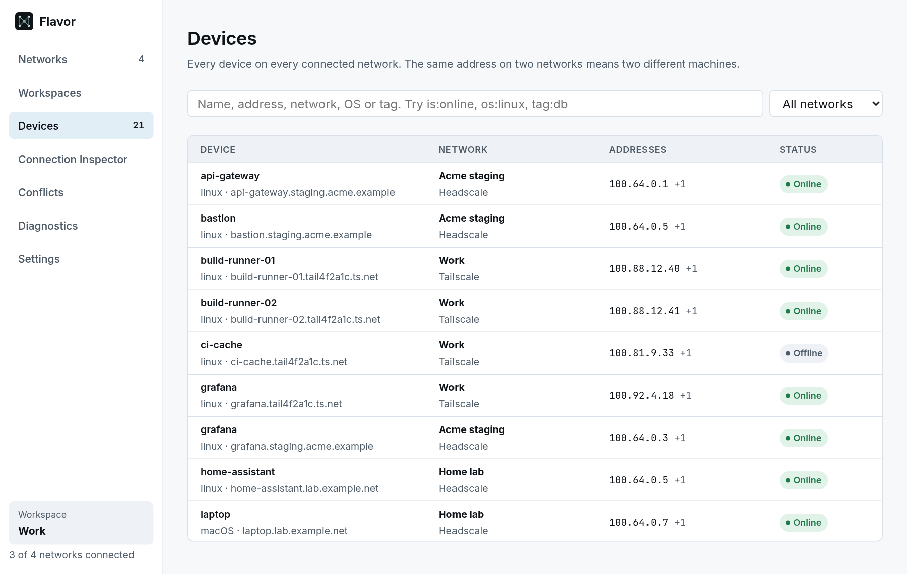

<div align="center">


# Flavor

**Several Tailscale and Headscale networks, connected side by side on one Linux or macOS desktop.**

Flavor is an open-source desktop app, CLI and per-user daemon for Linux and macOS. It keeps multiple tailnets connected at the same time, shows every device with the network it belongs to, and tells you where a connection will go when two networks use the same address.

[](https://github.com/tame-gg/Flavor/releases) [](https://aur.archlinux.org/packages/flavor-bin) [](https://github.com/tame-gg/Flavor/actions/workflows/ci.yml) [](LICENSE) [](#platform-support)

**[Install](#install)** · **[Quick start](#quick-start)** · **[Documentation](https://github.com/tame-gg/Flavor/wiki)** · **[Releases](https://github.com/tame-gg/Flavor/releases)**

</div>

<picture>
  <source media="(prefers-color-scheme: dark)" srcset="assets/screenshots/flavor-networks-dark.png">
  
</picture>

> [!NOTE]
> Flavor is in beta. Version 0.1.0-beta.5 runs on Linux and macOS (x86_64 and arm64). The project was called Lattice until 0.1.0-beta.2; upgrading keeps your networks and device identities ([details](https://github.com/tame-gg/Flavor/wiki/Install#upgrading-from-lattice)).

## Why Flavor?

Tailscale and Headscale connect your devices into private, WireGuard-based networks called tailnets. It is common to need more than one: a company tailnet, a Headscale server at home, a customer's network. Connecting to several at once is [one of Tailscale's longest-standing feature requests](https://github.com/tailscale/tailscale/issues/183), and the official Tailscale apps can only have [one tailnet active at a time](https://tailscale.com/docs/features/client/fast-user-switching), so reaching another means switching accounts.

Flavor keeps all of them connected. Each network runs as its own embedded Tailscale node with its own identity, so this computer appears as a separate machine on each one.

Using several networks at once brings a new problem: they can use the same addresses. With its default settings, Headscale hands out `100.64.0.1`, `100.64.0.2` and so on in order, so two Headscale networks usually overlap:

```text
Home lab       100.64.0.3  ->  pi-hole
Acme staging   100.64.0.3  ->  grafana
```

An address alone cannot tell those two machines apart. Flavor identifies every device by its network, and makes the network part of every decision:

| | What Flavor does |
| --- | --- |
| **See it** | The device list shows both machines, each with its network. The Conflict Center lists every address, name and subnet route that exists more than once. |
| **Explain it** | The Connection Inspector and `flavorctl explain` show every network a destination exists on, what matched and whether the answer is unique. Overlapping subnet routes resolve to the most specific one. |
| **Choose it** | Name the device together with its network (`pi-hole.home-lab.flavor.internal`), pass `--network` to `flavorctl forward`, or set a preference. Flavor never picks one at random. |
| **Connect to it** | `flavorctl forward` and `flavorctl socks` connect through the right network without changing system routing. |
| **Use it anywhere** | With the experimental helper, any program can resolve and connect to Flavor names. |

Everything except the last row runs as your user, with no extra privileges. The last row needs an optional helper that runs as root.

## Features

### Many networks at once

- Connect Tailscale accounts and any number of Headscale servers at the same time, all from one daemon.
- Each network is its own embedded Tailscale node ([`tsnet`](https://pkg.go.dev/tailscale.com/tsnet)) with its own node key, state and peers. You do not need the `tailscale` package or `tailscaled`.
- Sign in through the browser, or join with a one-time pre-auth key that is never stored.
- Device identities survive restarts, so networks reconnect without signing in again. Each network can connect automatically when Flavor starts.
- Workspaces connect a named set of networks, such as *Work* or *On call*, in one step.

### One device list

- Every device on every connected network in one searchable table. The same address on two networks shows up as two machines, because Flavor identifies devices by network and node.
- Search by name, address, network, OS or tag, with qualifiers such as `is:online` and `tag:db`.
- Device details show DNS names, addresses, routes and Flavor names, with buttons to copy them.

### Decisions you can read

- **Connection Inspector:** type an address or name and see which networks it exists on, how it matched, and why one answer wins or why none does.
- **Conflict Center** (the Conflicts page): every address, DNS name, device name and subnet route that exists more than once, sorted into expected overlaps and real ambiguities.
- **Flavor names** of the form `<device>.<network>.flavor.internal` point at one device, or are reported as ambiguous if two devices share a label.
- **Destination preferences** tell Flavor which network you mean for an exact address or name.

### Reach services without root

- `flavorctl forward` listens on a local port and forwards to a service on the network you choose.
- `flavorctl socks` runs a SOCKS5 proxy for browsers, curl and other clients.
- Both listen on loopback only, accept connections only from your own user, check every new connection again and refuse ambiguous destinations.
- **Experimental:** [system-wide names](https://github.com/tame-gg/Flavor/wiki/System-Wide-Names) let any program use Flavor names directly, through a small helper that runs as root with only `CAP_NET_ADMIN`. It is off by default and meant for single-user machines.

### Built for daily use

- A diagnostics page and `flavorctl diag`, which never include keys or sign-in links.
- `flavorctl` covers networks, device lists, decisions, workspaces and preferences, and adds forwarding and the proxy, with `--json` output for scripts.
- Closing the window keeps Flavor in the tray, and quitting the app never disconnects your networks.
- No telemetry, and Tailscale's log upload is turned off for every network.

<table>
  <tr>
    <td width="50%" valign="top">
      <picture>
        <source media="(prefers-color-scheme: dark)" srcset="assets/screenshots/flavor-inspector-dark.png">
        
      </picture>
      <p align="center"><sub><b>Same address, two networks.</b> Each match comes with the names that tell them apart.</sub></p>
    </td>
    <td width="50%" valign="top">
      <picture>
        <source media="(prefers-color-scheme: dark)" srcset="assets/screenshots/flavor-inspector-route-dark.png">
        
      </picture>
      <p align="center"><sub><b>Overlapping routes.</b> The most specific subnet route wins, and Flavor says why.</sub></p>
    </td>
  </tr>
  <tr>
    <td width="50%" valign="top">
      <picture>
        <source media="(prefers-color-scheme: dark)" srcset="assets/screenshots/flavor-conflicts-dark.png">
        
      </picture>
      <p align="center"><sub><b>Conflict Center.</b> Every overlap, sorted into expected and ambiguous.</sub></p>
    </td>
    <td width="50%" valign="top">
      <picture>
        <source media="(prefers-color-scheme: dark)" srcset="assets/screenshots/flavor-devices-dark.png">
        
      </picture>
      <p align="center"><sub><b>One device list.</b> Tailscale and Headscale devices together, each with its network.</sub></p>
    </td>
  </tr>
</table>

## Install

Flavor runs on Linux (x86_64 and arm64) with systemd. The desktop app needs glibc 2.39 or newer, WebKitGTK 4.1 and libayatana-appindicator ([details](https://github.com/tame-gg/Flavor/wiki/Install#requirements)).

**Release tarball,** for recent systemd-based distributions. Download and verify it first:

```bash
v=0.1.0-beta.5
base=https://github.com/tame-gg/Flavor/releases/download/v$v
curl -fLO $base/flavor-$v-linux-amd64.tar.gz -fLO $base/SHA256SUMS -fLO $base/SHA256SUMS.asc
sha256sum --check --ignore-missing SHA256SUMS
curl -fsSL https://github.com/ohemilyy.gpg | gpg --import
gpg --verify SHA256SUMS.asc SHA256SUMS
```

Continue only if the checksum is `OK` and `gpg` reports a good signature from the release key `0DFC 4321 62BF 84C0 FD78  0619 FBB9 6BCE C036 1F01`. Then install:

```bash
tar -xzf flavor-$v-linux-amd64.tar.gz
sudo ./flavor-$v-linux-amd64/install.sh
systemctl --user enable --now flavord
```

On arm64, replace `amd64` with `arm64`. `install.sh` needs root to copy files into `/usr` and `/etc`; Flavor itself runs as your user. A Sigstore signature and GitHub build provenance are also available; see [Verify the download](https://github.com/tame-gg/Flavor/wiki/Install#verify-the-download).

**Arch Linux,** from the AUR: [`flavor-bin`](https://aur.archlinux.org/packages/flavor-bin) repackages the signed release, and [`flavor`](https://aur.archlinux.org/packages/flavor) builds from the signed tag. With an AUR helper:

```bash
yay -S flavor-bin
systemctl --user enable --now flavord
```

The packages verify the release's GPG signature, so import the key first if your helper asks for it: `curl -fsSL https://github.com/ohemilyy.gpg | gpg --import` ([details](https://github.com/tame-gg/Flavor/wiki/Install#arch-linux)).

**macOS,** on Intel and Apple Silicon, with [Homebrew](https://github.com/tame-gg/homebrew-tap):

```bash
brew install tame-gg/tap/flavor
brew services start flavor
brew install --cask tame-gg/tap/flavor-desktop
```

The app is not notarized yet, so macOS blocks its first launch until you click **Open Anyway** in **System Settings › Privacy & Security**. Without Homebrew, install the `darwin-arm64` or `darwin-amd64` tarball from the [release](https://github.com/tame-gg/Flavor/releases) into your home directory. Both are covered in [macOS](https://github.com/tame-gg/Flavor/wiki/macOS).

**From source:** [build Flavor yourself](https://github.com/tame-gg/Flavor/wiki/Install#from-source), optionally into your home directory without root.

To remove Flavor, run `sudo /usr/libexec/flavor/uninstall`, or `sudo pacman -Rns flavor-bin` (or `flavor`) for the Arch packages. Your networks and identities stay in your home directory unless you delete them.

## Quick start

1. Start the daemon: `systemctl --user enable --now flavord`.
2. Open **Flavor** from your application menu and choose **Add network**.
3. For **Tailscale**, name the network, choose **Add network**, then **Open sign-in page** to sign in in your browser. For **Headscale**, also enter your server's address in **Control server**, then sign in through the browser or paste a pre-auth key.
4. Open **Devices** to see every machine on your networks, and the **Connection Inspector** to check where an address or name goes.

The [getting started guide](https://github.com/tame-gg/Flavor/wiki/Getting-Started) walks through each step, including Headscale registration and device approval.

## Command line

`flavorctl` talks to the same daemon as the desktop app:

```console
$ flavorctl add --name "Home lab" --headscale https://hs.home.example.net --auto-connect
01J9X4T6K8M2Q7R3V5W0YBZCDE
$ printf '%s\n' "$PREAUTH_KEY" | flavorctl enroll 01J9X4T6K8M2Q7R3V5W0YBZCDE

$ flavorctl explain 100.64.0.3
destination  100.64.0.3 (address)
decision     ambiguous: exists on 2 network(s); use a full DNS name to pick one
reason       multiple matches

NETWORK       DEVICE   MATCH           STATUS  ADDRESSES
Acme staging  grafana  device address  tied    100.64.0.3,fd7a:115c:a1e0::3
Home lab      pi-hole  device address  tied    100.64.0.3,fd7a:115c:a1e0::3
```

Reach a service on a specific network through a local port. `forward` prints the port and runs until you press Ctrl+C:

```console
$ flavorctl forward --listen 127.0.0.1:5432 postgres.acme-staging.flavor.internal:5432
Forwarding

  127.0.0.1:5432
      ↓
  postgres.acme-staging.flavor.internal:5432
      ↓
  Acme staging
      ↓
  100.64.0.2:5432

Reason: network qualified name
Each new connection is checked again before it is forwarded. Ctrl+C to stop.
```

Point your client at `127.0.0.1:5432`. Or start a SOCKS5 proxy on `127.0.0.1:1080` with `flavorctl socks`, and point clients at it from another terminal:

```console
$ curl --proxy socks5h://127.0.0.1:1080 http://pi-hole.home-lab.flavor.internal/
```

See the [flavorctl reference](https://github.com/tame-gg/Flavor/wiki/flavorctl-Reference) for every command, and [Names, decisions and connections](https://github.com/tame-gg/Flavor/wiki/Names-Decisions-and-Connections) for how Flavor decides.

## How it works

<picture>
  <source media="(prefers-color-scheme: dark)" srcset="assets/readme/architecture-dark.svg">
  
</picture>

| Component | Runs as | Role |
| --- | --- | --- |
| `flavor-desktop` | you | Desktop app: a Tauri 2 shell in Rust with a React interface |
| `flavorctl` | you | Command-line client for the same API |
| `flavord` | you, as a systemd user service | Daemon: one embedded Tailscale node per network, the decision engine, forwarding and the SOCKS5 proxy |
| `flavor-netd` | root, started on demand | Optional helper for system-wide names: a TUN interface, routes and systemd-resolved settings, with `CAP_NET_ADMIN` only |

The desktop app and `flavorctl` talk to `flavord` with [Connect-RPC](https://connectrpc.com) over a Unix socket that only your user can use. The app's webview never touches that socket; it can only call the desktop shell's own commands. See [Architecture](https://github.com/tame-gg/Flavor/wiki/Architecture) for details.

## Security and privacy

- **No root for everyday use.** `flavord` has no Linux capabilities. Only the optional helper runs as root, with `CAP_NET_ADMIN` only, polkit authorization, systemd sandboxing and an AppArmor or SELinux profile.
- **Your user only.** The daemon socket, forwarded ports and the SOCKS5 proxy all check that each connection comes from your user ID.
- **Keys are not kept.** Pre-auth keys are used once and never written to disk, logs or diagnostics. Each network's identity lives in its own directory under `~/.local/share/flavor`.
- **No telemetry.** Flavor sends nothing to its developers, and Tailscale's log upload is turned off.
- **Separate identities, shared process.** Networks are kept apart logically, but they run in one daemon process and are not sandboxed from each other.
- **Verifiable releases.** `SHA256SUMS` is signed with Sigstore and with the maintainer's GPG key, each tarball has a GitHub build-provenance attestation and an SBOM, and rebuilding a release commit with the same toolchains produces identical files.

Flavor has not had an independent security audit. Read the [security model](https://github.com/tame-gg/Flavor/wiki/Security-Model), and report vulnerabilities privately as described in [SECURITY.md](SECURITY.md).

## Platform support

| | Status |
| --- | --- |
| Linux on x86_64 and arm64, with systemd | Supported (beta) |
| macOS on Intel and Apple Silicon | Supported (beta); builds are not signed with an Apple Developer ID yet |
| Desktop app | Needs glibc 2.39 or newer, for example Ubuntu 24.04, Debian 13, Fedora 40 or newer, or Arch Linux |
| Headscale | Tested with Headscale 0.26.1 |
| Tailscale's hosted service | Implemented; live acceptance testing is still pending |
| System-wide names | Experimental; Linux only; needs systemd-resolved; single-user machines only |
| Windows | Not supported |

Flavor embeds version 1.90.9 of Tailscale's client library. Headscale supports a window of recent Tailscale client versions, so a much newer Headscale release may eventually need a newer Flavor. Flavor does not use or replace the official Tailscale client; running both at the same time has not been tested. The [tested environments](https://github.com/tame-gg/Flavor/wiki/Install#tested-environments) are listed in the install guide.

## Roadmap

**Available in v0.1.0-beta.5:** several Tailscale and Headscale networks at once, the device list, Connection Inspector, Conflict Center, Flavor names, destination preferences, workspaces, port forwarding, the SOCKS5 proxy, diagnostics, `flavorctl`, signed, reproducible and hardened (PIE, full RELRO) releases, macOS builds for Intel and Apple Silicon, a [Homebrew tap](https://github.com/tame-gg/homebrew-tap), and the [`flavor`](https://aur.archlinux.org/packages/flavor) and [`flavor-bin`](https://aur.archlinux.org/packages/flavor-bin) AUR packages.

**Experimental:** [system-wide names](https://github.com/tame-gg/Flavor/wiki/System-Wide-Names) through the `flavor-netd` helper.

**Planned, not built yet:**

- System-wide names on multi-user machines
- Exit nodes, subnet route controls and an HTTP proxy
- Signed and notarized macOS builds ([#15](https://github.com/tame-gg/Flavor/issues/15))
- Windows
- Removing machines from the control server

## Documentation

The guides live in the [project wiki](https://github.com/tame-gg/Flavor/wiki):


- [Install, verify, upgrade and uninstall](https://github.com/tame-gg/Flavor/wiki/Install)
- [Getting started](https://github.com/tame-gg/Flavor/wiki/Getting-Started)
- [Names, decisions and connections](https://github.com/tame-gg/Flavor/wiki/Names-Decisions-and-Connections)
- [flavorctl reference](https://github.com/tame-gg/Flavor/wiki/flavorctl-Reference)
- [System-wide names (experimental)](https://github.com/tame-gg/Flavor/wiki/System-Wide-Names)
- [Troubleshooting](https://github.com/tame-gg/Flavor/wiki/Troubleshooting)
- [Security model](https://github.com/tame-gg/Flavor/wiki/Security-Model)
- [Architecture](https://github.com/tame-gg/Flavor/wiki/Architecture)

## Contributing and support

| To | Go to |
| --- | --- |
| Report a bug | [Bug report](https://github.com/tame-gg/Flavor/issues/new?template=bug_report.yml) |
| Suggest a feature | [Feature request](https://github.com/tame-gg/Flavor/issues/new?template=feature_request.yml) |
| Ask a question | [Open an issue](https://github.com/tame-gg/Flavor/issues/new/choose) |
| Contribute code or docs | [CONTRIBUTING.md](CONTRIBUTING.md) |
| Report a vulnerability | Privately, as described in [SECURITY.md](SECURITY.md) |

Everyone taking part is expected to follow the [code of conduct](CODE_OF_CONDUCT.md).

## Related projects

Other open-source projects approach several tailnets at once in different ways, for example:

- [tailmux](https://github.com/GrowlyX/tailmux): a daemon, CLI and desktop app for macOS, Windows and Linux, with a TUN mode and a proxy mode.
- [tailmix](https://github.com/maisem/tailmix): several tsnet nodes behind one TUN device, for macOS and Linux.
- [Tailhopper](https://github.com/Jcambass/tailhopper): one SOCKS5 proxy per tailnet.
- [Hydrascale](https://github.com/Crank-Git/Hydrascale): one `tailscaled` per tailnet, each in its own network namespace, on Linux.

For a single tailnet on Linux, [Trayscale](https://github.com/DeedleFake/trayscale) and [KTailctl](https://github.com/f-koehler/KTailctl) are desktop interfaces for the official Tailscale client.

## Acknowledgements

Flavor is built on Tailscale's [`tsnet`](https://pkg.go.dev/tailscale.com/tsnet) library, [Tauri](https://tauri.app), [Connect](https://connectrpc.com) and the [gVisor](https://gvisor.dev) network stack, and is tested against [Headscale](https://github.com/juanfont/headscale).

Flavor is an independent project. It is not affiliated with or endorsed by Tailscale Inc. or the Headscale project. Tailscale is a trademark of Tailscale Inc. WireGuard is a registered trademark of Jason A. Donenfeld.

## License

[MIT](LICENSE) © 2026 Luna
