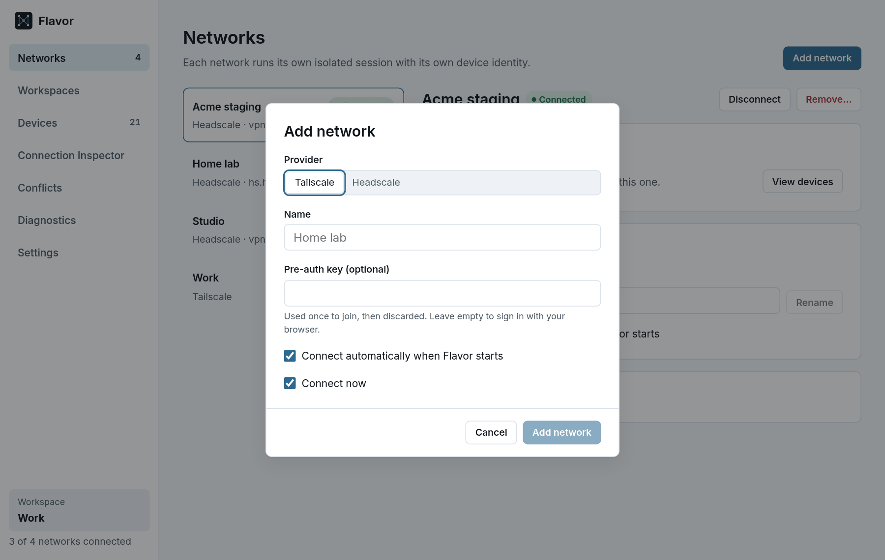
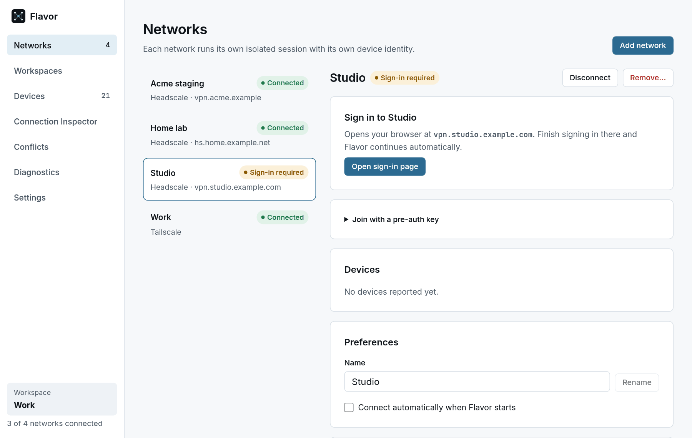

# Getting started

This guide takes you from a fresh installation to a connected network, its devices, and a working connection to one of them. If Flavor is not installed yet, start with [Install](install.md).

## 1. Start the daemon

The desktop app and `flavorctl` both talk to `flavord`, a small daemon that runs as your user. Enable it once; it then starts whenever you log in:

```bash
systemctl --user enable --now flavord
flavorctl info
```

`flavorctl info` prints the daemon version when it is running.

## 2. Open the app

Open **Flavor** from your application menu, or run `flavor-desktop`. The first screen says *Nothing on this computer changes until you add a network*: Flavor connects nothing until you add one.

If the app shows *The Flavor daemon is not running*, start it with `systemctl --user start flavord`. The app keeps retrying in the background.

## 3. Add a network

Choose **Add your first network**, or **Add network** on the Networks page. Pick the provider, give the network a name, and choose how to join.

<picture>
  <source media="(prefers-color-scheme: dark)" srcset="../assets/screenshots/flavor-add-network-dark.png">
  
</picture>

The name is up to you. It also becomes part of each device's Flavor name: a network called "Home lab" gives names like `nas.home-lab.flavor.internal`.

### A Tailscale account

1. Choose **Tailscale**, enter a name such as *Work*, and leave the pre-auth key empty.
2. Choose **Add network**. With *Connect now* ticked, the network starts connecting and shows **Sign-in required**.
3. Choose **Open sign-in page**. The panel shows which host the link opens before you click. Sign in to your tailnet in the browser as usual.
4. Back in Flavor, the network turns **Connected** by itself.

If your tailnet requires device approval, the network shows **Awaiting approval** until an administrator approves the device in the Tailscale admin console. Flavor then connects automatically.

<picture>
  <source media="(prefers-color-scheme: dark)" srcset="../assets/screenshots/flavor-sign-in-dark.png">
  
</picture>

### A Headscale server

1. Choose **Headscale**, enter a name, and enter the server's address in **Control server**, for example `https://headscale.example.com`.
2. Join in one of two ways:
   - **In the browser.** Leave the key empty and choose **Add network**, then **Open sign-in page**. If your Headscale server uses an identity provider, sign in there. Otherwise the page shows the `headscale` command an administrator runs on the server to register this machine. Flavor connects as soon as the machine is registered.
   - **With a pre-auth key.** Create a key on the server and paste it into **Pre-auth key (optional)** before choosing **Add network**, or later under **Join with a pre-auth key**. On Headscale 0.26 you can create one with `headscale preauthkeys create --user <user-id> --expiration 24h` (`headscale users list` shows user IDs; check your Headscale version's documentation). The key is used once and never stored.

You can add as many networks as you like, from any mix of Tailscale accounts and Headscale servers. Each one gets its own device identity, so this computer appears as a separate machine on each network.

## 4. See your devices

The **Devices** page lists every device on every connected network in one table, with the network each one belongs to. The same address on two networks means two different machines, and Flavor shows them as two rows.

- Search by name, address, network, OS or tag, or use qualifiers: `is:online`, `is:offline`, `is:local`, `os:linux`, `tag:db`, `network:work`.
- Select a device to see its DNS name, addresses, routes, tags and Flavor name, with buttons to copy them. **Copy SSH command** copies `ssh <device's DNS name>` to the clipboard. That MagicDNS name only resolves if your system already uses that network's DNS; otherwise forward the SSH port first (`flavorctl forward <Flavor name>:22`) and connect to the local port it prints.

## 5. Check where a destination goes

Open the **Connection Inspector** and type an address or name, for example `100.64.0.3` or `postgres`. Flavor shows every network it exists on, which device or subnet route matched, and whether the answer is unique. If it exists on several networks, use one of the device's Flavor names, or choose **Prefer** to tell Flavor which network you mean.

The **Conflicts** page lists every address, name and subnet route that exists more than once, and whether that is an expected overlap or a real ambiguity. [Names, decisions and connections](networking.md) explains the rules.

## 6. Connect to a service

Programs other than Flavor reach your networks through `flavorctl`, without root and without changing system networking:

```bash
flavorctl forward postgres.acme-staging.flavor.internal:5432
flavorctl socks
curl --proxy socks5h://127.0.0.1:1080 http://grafana.acme-staging.flavor.internal:3000/
```

`forward` listens on a local port and prints it; `socks` starts a SOCKS5 proxy on `127.0.0.1:1080`. Both run until you press Ctrl+C. See [Reach a service without root](networking.md#reach-a-service-without-root). To use Flavor names in any program without a proxy, see the experimental [system-wide names](system-wide-names.md).

## 7. Everyday use

- **Connect automatically when Flavor starts** is a per-network setting on the Networks page.
- **Workspaces** group networks, such as *Work* or *On call*, so you can connect them in one step.
- Closing the window keeps Flavor in the tray by default; change this in **Settings → When the window closes**. Quitting the desktop app never stops `flavord` or disconnects your networks.
- Removing a network leaves this computer's identity files on disk; **Also delete this device's local identity** deletes them too. Adding a network again creates a new identity, so you sign in again and the computer joins as a new machine.

## The same steps with flavorctl

```bash
flavorctl add --name Work --auto-connect
flavorctl add --name "Home lab" --headscale https://hs.home.example.net --auto-connect

flavorctl connect <work-network-id>
flavorctl list
printf '%s\n' "$PREAUTH_KEY" | flavorctl enroll <home-lab-network-id>

flavorctl devices
flavorctl explain 100.64.0.3
```

`flavorctl add` prints the new network's ID. `flavorctl list` shows a sign-in link for any network that needs one. The [flavorctl reference](cli.md) covers every command.

## Next

- [Names, decisions and connections](networking.md)
- [flavorctl reference](cli.md)
- [Troubleshooting](troubleshooting.md)
