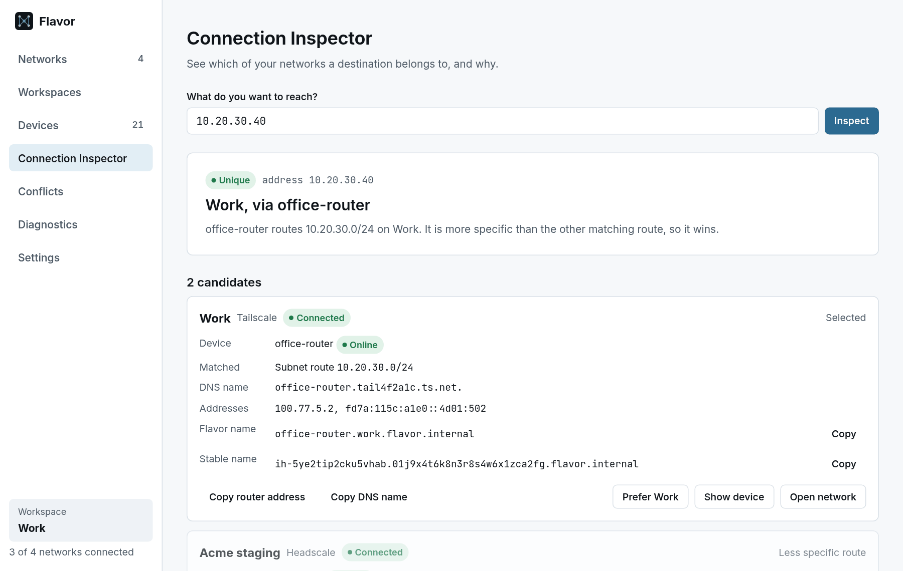
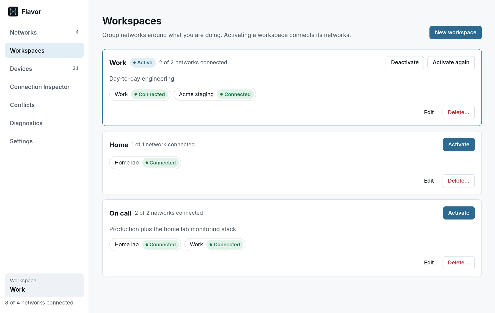

# Names, decisions and connections

When you use several Tailscale and Headscale networks at once, the same address or name can exist on more than one of them. This page explains how Flavor identifies devices, how it decides which network a destination belongs to, and how you can connect to services on a specific network.

The examples use three connected networks (**Home lab** and **Acme staging** on Headscale, **Work** on Tailscale) and one that still needs sign-in (**Studio**). Headscale hands out addresses in order, so both Headscale networks have a device at `100.64.0.3`.

## Devices belong to networks

Flavor identifies every device by its network and its node ID, never by its address alone. `100.64.0.3` on Home lab and `100.64.0.3` on Acme staging are two different machines, and Flavor shows and handles them as two different machines everywhere: in the device list, the Connection Inspector, the Conflict Center, the CLI and the API.

## Names

You can refer to a destination in several ways:

| Form | Example | Unique? |
| --- | --- | --- |
| Address | `100.64.0.3`, or `10.20.30.40` inside an advertised subnet route | Not when two networks use the same address or route |
| MagicDNS name | `pi-hole.lab.example.net`, `grafana.tail4f2a1c.ts.net` | Usually; each network has its own DNS suffix |
| Device name | `grafana`, `pi-hole` | Not when two networks have a device with that name |
| Flavor name | `pi-hole.home-lab.flavor.internal` | Always points at one device, or is reported as ambiguous |

### Flavor names

Flavor gives every device a name of the form `<device>.<network>.flavor.internal`:

- The **network label** comes from the network's display name: lower case, with runs of other characters replaced by `-`. "Home lab" becomes `home-lab`. If two networks would get the same label, neither gets it.
- The **device label** is the device's host name, if it is a valid DNS label and unique within that network.
- Every device also has a **stable name** that survives renames: `id-<node>` for numeric Headscale node IDs (or a short hash for other node IDs), followed by the network ID, for example `id-3.01j9x4t6k8m2q7r3v5w0ybzcde.flavor.internal`. The device details panel and the Connection Inspector show both names.

Flavor names work in the Connection Inspector, `flavorctl explain` and `flavorctl forward`, through the SOCKS5 proxy, and, with the experimental helper, in any program through [system-wide names](system-wide-names.md). `flavor.internal` uses the `.internal` top-level domain, which is reserved for private use.

## How Flavor decides

One decision engine answers every question about where a destination goes: the Connection Inspector, `flavorctl explain`, forwarding, the SOCKS5 proxy and system-wide names all use it. It works through these rules in order:

1. **An explicit network wins.** `flavorctl forward --network`, or a Flavor name, limits the search to that one network.
2. **A destination preference applies** if you set one for this exact destination, its network is connected, and that network has a match. See [Destination preferences](#destination-preferences).
3. **For addresses,** an exact device address beats a subnet route. Among subnet routes, the longest prefix wins. Equal-length routes on two networks are ambiguous.
4. **For names,** a full DNS name beats a device name.
5. **Anything else is ambiguous or has no match.** Flavor never resolves an ambiguous destination by guessing, by connection order or by network order.

Only connected networks are checked. Others are listed as not checked, so you can tell "no match" from "not looked at".

An address that exists on two networks:

```console
$ flavorctl explain 100.64.0.3
destination  100.64.0.3 (address)
decision     ambiguous: exists on 2 network(s); use a full DNS name to pick one
reason       multiple matches

NETWORK       DEVICE   MATCH           STATUS  ADDRESSES
Acme staging  grafana  device address  tied    100.64.0.3,fd7a:115c:a1e0::3
Home lab      pi-hole  device address  tied    100.64.0.3,fd7a:115c:a1e0::3

not checked (not connected): Studio
```

An address inside two overlapping subnet routes, where the more specific one wins:

```console
$ flavorctl explain 10.20.30.40
destination  10.20.30.40 (address)
decision     unique: office-router on Work
reason       longest prefix

NETWORK       DEVICE         MATCH                       STATUS     ADDRESSES
Work          office-router  subnet route 10.20.30.0/24  selected   100.77.5.2,fd7a:115c:a1e0::4d01:502
Acme staging  vpc-router     subnet route 10.20.0.0/16   outranked  100.64.0.4,fd7a:115c:a1e0::4

not checked (not connected): Studio
```

Explaining a destination does not connect to it, probe it or change anything.

## Connection Inspector

The Connection Inspector in the desktop app shows the same decision with more context: the matching devices, how each one matched, their DNS and Flavor names, and buttons to copy a name, prefer a network or open the device.

<picture>
  <source media="(prefers-color-scheme: dark)" srcset="../assets/screenshots/flavor-inspector-route-dark.png">
  
</picture>

## Conflict Center

The Conflicts page, and `flavorctl conflicts`, list every address, DNS name, device name and subnet route that exists more than once across your connected networks. Each one is either:

- **Expected overlap.** For example, both Headscale networks use `100.64.0.3`, but each device also has a unique DNS name, so it can always be reached unambiguously. A smaller subnet route inside a larger one is also expected: the more specific route decides.
- **Ambiguous.** Nothing tells the devices apart, for example when two networks advertise the same subnet route, or several devices on one network share a name.

In the desktop app, a conflict that a [destination preference](#destination-preferences) settles is shown as **Resolved by preference**. `flavorctl conflicts` does not take preferences into account.

```console
$ flavorctl conflicts
192.168.1.0/24  subnet overlap
  ambiguous: the same route is advertised on several networks
  id subnet:192.168.1.0/24
  NETWORK       ROUTER      ROUTE
  Acme staging  vpc-router  192.168.1.0/24
  Home lab      nas         192.168.1.0/24

…

100.64.0.3  address collision
  expected overlap: network-specific DNS names stay unambiguous
  id address:100.64.0.3
  NETWORK       DEVICE   ADDRESSES                     UNIQUE NAME
  Acme staging  grafana  100.64.0.3,fd7a:115c:a1e0::3  grafana.staging.acme.example
  Home lab      pi-hole  100.64.0.3,fd7a:115c:a1e0::3  pi-hole.lab.example.net
```

Collisions that involve only this computer's own addresses on each network are left out, because they cannot be confused.

## Destination preferences

A preference tells Flavor which network you mean when you use a particular address or name:

```console
$ flavorctl preference set 100.64.0.3 --network "Home lab"
100.64.0.3 now prefers Home lab (a Flavor preference; system routing is not changed)
```

In the desktop app, use **Prefer** next to a candidate in the Connection Inspector or a member of a conflict.

- A preference applies to that exact destination only. Preferring `100.64.0.3` says nothing about `100.64.0.4`.
- It is used by Flavor's own decisions: the inspector, forwarding, the SOCKS5 proxy and system-wide names. It does not change system routing.
- If the preferred network is not connected, or has no matching device, the preference is not applied and normal matching continues. The inspector says why. To pin a connection to one network no matter what, use a Flavor name or `--network` instead.

`flavorctl preference list` shows your preferences and `flavorctl preference remove <destination>` deletes one.

## Reach a service without root

Flavor connects to services through each network's embedded Tailscale node, inside the daemon. This works without the system-wide helper and without changing system networking. Both methods below are available from `flavorctl`; they listen on loopback only and refuse connections from other local users.

### Forward a local port

`flavorctl forward` listens on a local port and forwards every connection to one destination:

```console
$ flavorctl forward postgres.acme-staging.flavor.internal:5432
Forwarding

  127.0.0.1:41753
      ↓
  postgres.acme-staging.flavor.internal:5432
      ↓
  Acme staging
      ↓
  100.64.0.2:5432

Reason: network qualified name
Each new connection is checked again before it is forwarded. Ctrl+C to stop.
opened  #1  127.0.0.1:52144 -> Acme staging 100.64.0.2:5432
```

Point your client at the local address, for example `psql -h 127.0.0.1 -p 41753`. Use `--listen 127.0.0.1:5432` to choose the port and `--network <name or id>` to pick the network for a plain address or device name. Forwarding runs until you press Ctrl+C.

### SOCKS5 proxy

`flavorctl socks` starts a SOCKS5 proxy on `127.0.0.1:1080` (change it with `--listen`). Programs that support SOCKS5 can then reach any destination on your connected networks:

```console
$ flavorctl socks
SOCKS5 proxy on 127.0.0.1:1080 (this user only)

Only devices and routes on your Flavor networks are reachable; ambiguous addresses are refused.
Let Flavor resolve names: use socks5h / remote DNS, for example

  curl --proxy socks5h://127.0.0.1:1080 http://grafana.home.flavor.internal:3000/

Ctrl+C to stop.
```

Configure clients to let the proxy resolve names (`socks5h://` in curl, "proxy DNS when using SOCKS v5" in browsers), so Flavor names and MagicDNS names reach Flavor. A destination that exists on several networks is refused instead of guessed:

```console
opened  #1  grafana.acme-staging.flavor.internal:3000 -> Acme staging 100.64.0.3:3000
closed  #1  sent 78 B, received 1452 B
refused #2  100.64.0.3:3000: 100.64.0.3 matches 2 candidates on 2 network(s); use a Flavor name, a preference or an explicit network
```

The proxy supports the SOCKS5 `CONNECT` command (TCP) without authentication. Forwarding and the proxy are available from the command line only; the desktop app does not start them.

## Workspaces

A workspace is a named set of networks, such as Work, Home or On call. Activating one connects its networks in one step, and can also disconnect every other network:

```console
$ flavorctl workspace activate --disconnect-others "On call"
activated On call
  Home lab      already active
  Work          already active
  Acme staging  disconnected
  Studio        disconnected
```

Workspaces only connect and disconnect networks. They never change device identities, preferences or routing.

<picture>
  <source media="(prefers-color-scheme: dark)" srcset="../assets/screenshots/flavor-workspaces-dark.png">
  
</picture>
