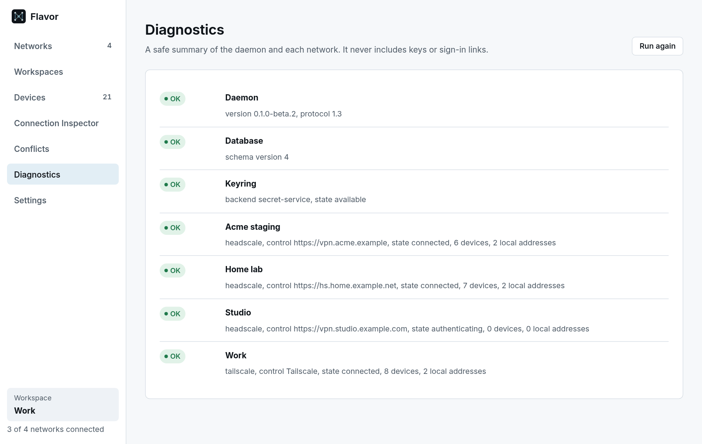

# Troubleshooting

Start with the two places Flavor reports problems:

```bash
flavorctl diag
journalctl --user -u flavord -e
```

`flavorctl diag`, and the Diagnostics page in the app, show the daemon version, database, keyring and the state of each network. They never include keys or sign-in links, so you can paste them into an issue.

<picture>
  <source media="(prefers-color-scheme: dark)" srcset="../assets/screenshots/flavor-diagnostics-dark.png">
  
</picture>

## The daemon

### "The Flavor daemon is not running"

The desktop app shows this, and `flavorctl` prints `flavorctl: the Flavor daemon is not running`, when it cannot reach `flavord` on its socket (`$XDG_RUNTIME_DIR/flavor/flavord.sock`).

```bash
systemctl --user enable --now flavord
systemctl --user status flavord
```

If you installed from source, check that the user unit points at your `flavord` (`ExecStart=%h/.local/bin/flavord` by default).

### flavord exits right away

Check `journalctl --user -u flavord -e`. Common causes:

| Log message | Cause |
| --- | --- |
| `another flavord instance is running for this user` (exit status 3) | A second copy was started, for example from a terminal while the service runs. Only one `flavord` runs per user. |
| `invalid --log-level` or another flag error (exit status 2) | A typo in a `systemctl --user edit flavord` override. |
| `Lattice's latticed is still running for this user` | Flavor wants to move your data from Lattice but Lattice is still running. Stop it with `systemctl --user disable --now latticed`, then start `flavord` again. |
| `Lattice data found but not migrated because Flavor data already exists` | A warning, not an error: both `~/.local/share/lattice` and `~/.local/share/flavor` exist, so Flavor left the Lattice data alone. Move or delete one of them yourself. |

## The desktop app

### It does not start

Run `flavor-desktop` in a terminal to see the error.

- `error while loading shared libraries: libwebkit2gtk-4.1.so.0`: install the [desktop libraries](install.md#requirements) for your distribution.
- `Failed to load ayatana-appindicator3 or appindicator3 dynamic library`: the tray library is loaded when the app starts and is missing. Install libayatana-appindicator (`libayatana-appindicator3-1` on Debian and Ubuntu, `libayatana-appindicator-gtk3` on Fedora).
- ``version `GLIBC_2.39' not found``: your distribution's C library is older than the desktop app needs. The daemon and `flavorctl` still work; [build the desktop app from source](install.md#from-source) or use a newer distribution.

### No tray icon

The tray icon uses libayatana-appindicator and needs a desktop that shows status icons. On GNOME this requires an AppIndicator extension. Without a tray, set **Settings → When the window closes → Quit the window** so closing the window does not hide it. Your networks stay connected either way.

## Signing in

- **The sign-in button does nothing, or says the link is not a web address.** Flavor only opens `http` and `https` links without an embedded user name or password, and only in your default browser. Check that a default browser is configured (`xdg-open https://example.com`).
- **"This sign-in link has expired".** The control server started a new sign-in attempt. The network page now shows the current link; use that one.
- **Stuck on "Awaiting approval".** The tailnet requires device approval. An administrator has to approve the device in the Tailscale admin console; Flavor connects automatically afterwards.
- **"Enter a control server address starting with https:// or http://".** The Headscale URL must be a plain `https://` or `http://` address without a user name or password.
- **A pre-auth key is rejected.** Keys are single-use unless created as reusable, and they expire. Create a new one on the server.

## Reaching devices

### "Exists on 2 network(s)" or "matches 2 candidates"

The address or name exists on more than one connected network, and Flavor will not guess. Use one of:

- a Flavor name, such as `pi-hole.home-lab.flavor.internal` (the Connection Inspector shows each device's names),
- `flavorctl forward --network <name> …`,
- a [destination preference](networking.md#destination-preferences).

### The SOCKS5 proxy refuses a connection

`flavorctl socks` prints a `refused` line with the reason. Make sure the client lets the proxy resolve names (`socks5h://` rather than `socks5://` in curl); otherwise the client sends an address, which may be ambiguous. Clients see ambiguous destinations as SOCKS5 error 2, unknown ones as error 4 and unreachable ones as error 5.

### "connection from another local user refused"

Forwarding and the SOCKS5 proxy only accept connections from your own user ID. Run the client as the same user as `flavord`.

### "Not checked (not connected)"

Flavor only looks at connected networks. Connect the network, or activate a workspace that contains it.

## System-wide names

Problems with the experimental [system-wide names](system-wide-names.md) appear in the daemon's log:

```bash
journalctl --user -u flavord -e | grep -i -E 'synthetic|flavor-netd|system dns'
sudo journalctl -u flavor-netd -e
```

When everything works, the log shows `synthetic interface active` with the interface name. Failures show `synthetic networking unavailable` with the reason:

| Error | Meaning |
| --- | --- |
| `flavor-netd is not reachable: …` | Nothing listens on `/run/flavor/netd.sock`. Enable the helper's socket with `sudo systemctl enable --now flavor-netd.socket`; the Arch packages do not enable it. |
| `flavor-netd: ERROR_CODE_UNAUTHORIZED: …` | polkit refused, or there is no active local login session for your user. Remote (SSH) sessions are not allowed. |
| `flavor-netd: ERROR_CODE_HOST_INSTANCE_IN_USE: …` | Another user on this computer already uses system-wide names. Only one user can at a time. |
| `flavor-netd: ERROR_CODE_RANGE_OVERLAP: …` | One of Flavor's address ranges overlaps an existing address, route or routing rule. Flavor refuses rather than shadow your network. |
| `flavor-netd: ERROR_CODE_TUN_UNAVAILABLE: …` | `/dev/net/tun` could not be opened. |

Other symptoms:

- **`system dns not configured for flavor names`.** The interface works, but systemd-resolved did not accept the DNS settings, so names do not resolve. With `ERROR_CODE_RESOLVED_UNAVAILABLE`, systemd-resolved is not running or not reachable on D-Bus. Check `resolvectl status`.
- **`ipv4 synthetic addresses disabled`.** Flavor's stored IPv4 range now overlaps a local network, so names resolve to IPv6 addresses only for this run.
- **Names do not resolve at all.** Check that `/etc/resolv.conf` points at systemd-resolved's stub resolver, and that the override from [Turn it on](system-wide-names.md#turn-it-on) is in place (`systemctl --user cat flavord`).
- **`ping` fails.** Expected: ICMP is not supported. Test with `curl` or another TCP or UDP client.

## Still stuck?

[Open an issue](https://github.com/tame-gg/Flavor/issues/new/choose) with the output of `flavorctl info` and `flavorctl diag`, your distribution, how you installed Flavor, and the relevant log lines. Remove pre-auth keys, sign-in links and anything else you do not want to publish. Report security problems privately as described in [SECURITY.md](../SECURITY.md).
